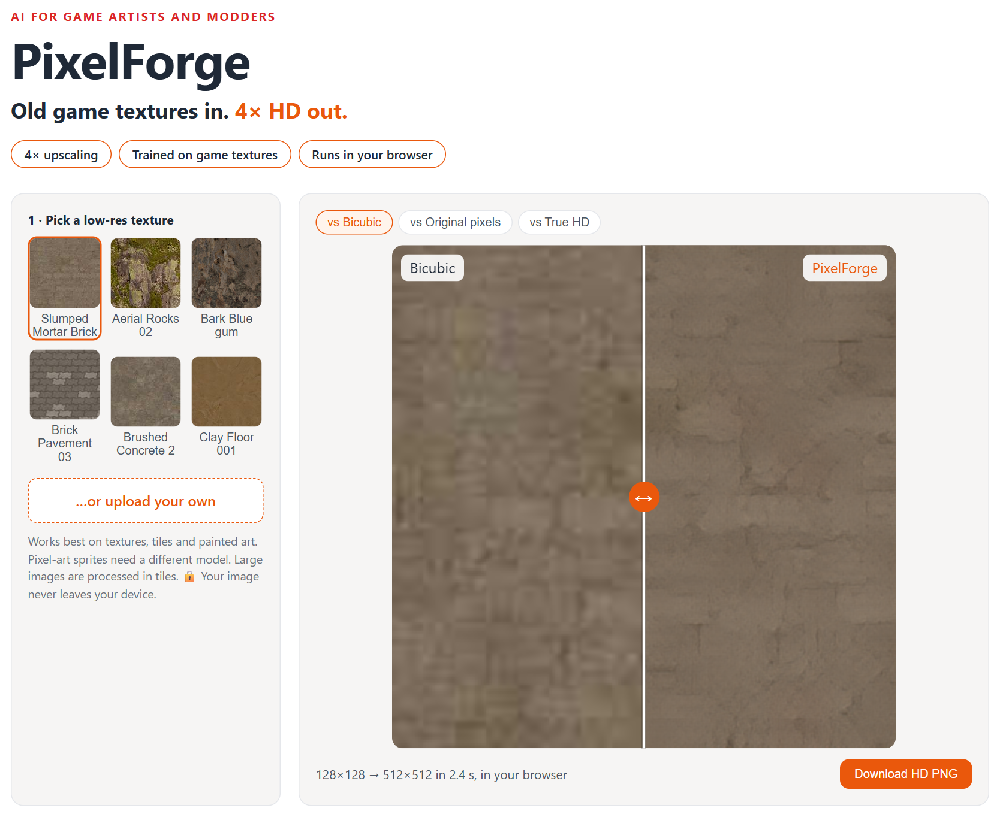
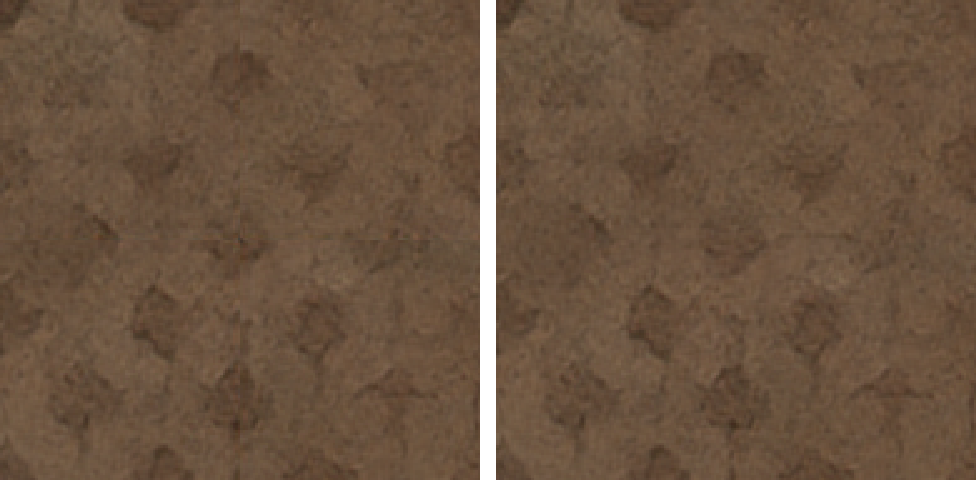
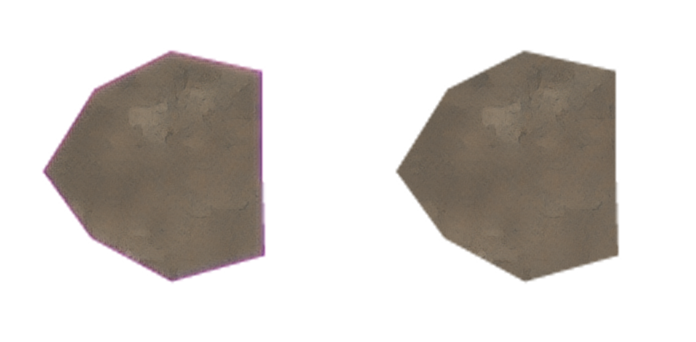
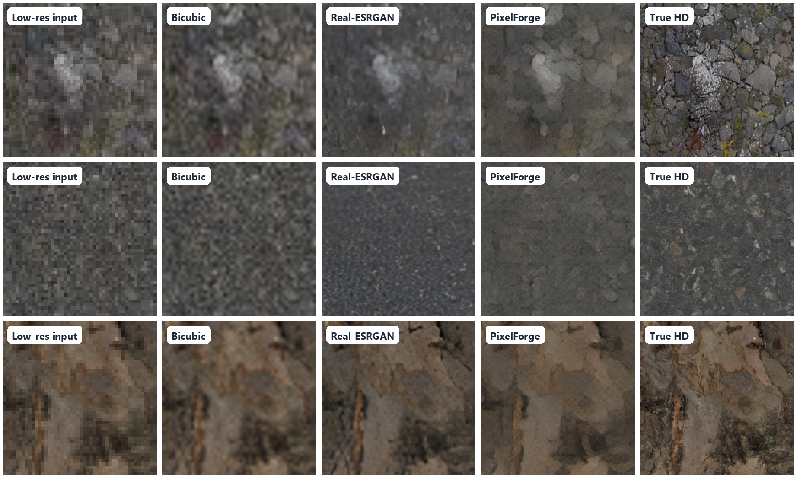

# PixelForge Engine

**Old game textures in. 4× HD out.** An open upscaling engine for game modders: batch whole texture packs, keep seamless
tiles seamless, keep transparency clean.

PixelForge is a 4× super-resolution model trained on game textures. It turns low-res, compressed textures into
clean HD versions, for HD texture mods, remasters and asset libraries. It runs in your browser, so your art
never leaves your machine.

**[▶ Try the live demo](https://priyanshu-singh-git.github.io/pixelforge/)** (before/after slider, upload your own, download the HD PNG)



## Use the engine

**In the browser** (nothing to install): [open PixelForge Engine](https://priyanshu-singh-git.github.io/pixelforge/), drop in one
texture or a whole selection, tick **Seamless / tileable** for repeating textures, and download a ZIP. Files never leave your machine.

**From the command line** (thousands of files, GPU if you have one):

```bash
pip install git+https://github.com/Priyanshu-Singh-git/pixelforge
pixelforge upscale ./textures ./textures_hd            # folder in -> folder out, sub-folders and names kept
pixelforge upscale ./tiles ./tiles_hd --tileable       # seamless textures stay seamless
pixelforge export PixelForge_4x.pth                    # ESRGAN-format weights + model card
```

Weights and an ONNX model are also on the [releases page](https://github.com/Priyanshu-Singh-git/pixelforge/releases).

| Engine feature | Without it | With PixelForge Engine |
|---|---|---|
| Seamless tiles (30 test textures repeated 2×2) | 24 of 30 show a visible seam | **2 of 30** |
| Transparent edges (20 decals with junk colour under alpha) | coloured halo, edge error 16.1 | **1.6 (−90%)** |
| Batch speed (60 textures, 128→512) | – | **0.21 s each on GPU (RTX 3050), 0.55 s on CPU** |


*Where four copies of a tiling texture meet: normal upscale (left) shows a seam cross; `--tileable` (right) doesn't.*


*A decal with magenta hidden under its transparent pixels: naive upscale (left) bleeds a halo; PixelForge (right) stays clean.*

**Tool compatibility:** the exported `.pth` uses ESRGAN layer names, but chaiNNer's loader (spandrel 0.4) assumes standard
ESRGAN widths and rejects this compact model. Use the CLI, the browser, or the ONNX file from the releases page.

**Upscaling a game's own textures:** the engine is fine to use, but redistributing upscaled copies of a game's assets depends on
that game's terms. Check before publishing a mod.

## Results

60 held-out test textures (never used for training or model selection), damaged the way old assets are
(blur, downscaling, noise, JPEG compression), then upscaled 4× (128×128 → 512×512):

| Method | Size | Pixel accuracy (PSNR ↑) | Looks like real HD (LPIPS ↓) | CPU time / texture |
|---|---|---|---|---|
| Bicubic resize | – | 29.31 dB | 0.707 | – |
| Real-ESRGAN x4plus (official, trained on photos) | 16.7M params | 27.76 dB | 0.454 | 4.3 s |
| **PixelForge GAN** (the demo model) | **1.1M params** | **28.76 dB** | **0.414** | **0.48 s** |
| PixelForge L1 (fidelity-first) | 1.1M params | **29.73 dB** | 0.659 | 0.47 s |

- **41% closer to the real HD look than bicubic** (LPIPS 0.707 → 0.414).
- **Beats the official Real-ESRGAN on both metrics** on game textures, with **15× fewer parameters**, about 9× faster on CPU
  and 5× faster on GPU.
- In a laptop browser: about **2.3 s** per 128→512 texture (ONNX Runtime Web, no GPU).

*Note: PSNR rewards "safe", slightly blurry guesses, so bicubic scores well on it. The GAN model trades a little pixel
accuracy for realistic detail. The L1 model is the choice when exact fidelity matters.*



*The textures with the **median** improvement over bicubic (very dark textures excluded), centre crops. Honest
reading: PixelForge removes noise and JPEG blocks cleanly, but cannot recover fine detail that the tiny
input no longer contains; Real-ESRGAN adds sharper but partly invented grain.*

The cover/hero image (Slumped Mortar Brick) is a **strong** example (top 5 of 60 by improvement), not a typical one.

## How it works

1. **Data:** 858 CC0 textures from [Poly Haven](https://polyhaven.com/textures) (bricks, wood, metal, ground, fabric, stone),
   split **by texture** into 738 train / 60 validation / 60 test.
2. **Degradation pipeline:** each training patch is damaged on the fly (random blur, random-kernel 4× downscale,
   Gaussian noise, JPEG q40–95), a simplified version of Real-ESRGAN's pipeline, so the model learns to undo it.
3. **Generator:** a compact ESRGAN **RRDB** network (6 residual-in-residual dense blocks, 32 features, 1.1M params).
4. **Training (RTX 3050 laptop GPU):**
   - L1 stage: 15k iterations, 32 min.
   - GAN stage: VGG19 perceptual loss + U-Net discriminator with spectral norm + generator EMA (Real-ESRGAN recipe).
     Planned for 6k iterations, **stopped at 4k** when validation LPIPS plateaued (0.4062 → 0.4061).
5. **Deployment:** exported to ONNX (4.5 MB), run in the browser with tiling. Verified against PyTorch: max difference
   1/255 per pixel on every sample, and no visible tile seams on a tiled 300×300 upload.

### For engineers: what the ablations showed

- **Architecture:** the 7× smaller **SRVGG-S** (0.16M) comes within 0.07 dB PSNR of RRDB-S and is slightly *better* on LPIPS
  (0.636 vs 0.659), at 15 ms vs 39 ms on GPU and 36 ms vs 465 ms on CPU. It's the natural candidate for a real-time version.
- **L1 vs GAN:** the GAN stage cuts LPIPS 0.659 → 0.414 at a cost of 0.97 dB PSNR (fidelity vs realism trade-off).
- **Domain matters:** a 1.1M model trained on game textures beats the 16.7M photo-trained Real-ESRGAN on this test set.
- Full tables (both degradation settings, SSIM, GPU/CPU timings): **[eval/results.md](eval/results.md)**.

Limitations: single run per model; synthetic degradations; pixel-art sprites and normal maps not yet handled.

## Run it yourself

```bash
pip install -r requirements-dev.txt
python train/download_data.py                 # 858 CC0 textures + split manifest
bash train/run_all.sh                         # L1 RRDB-S, L1 SRVGG-S, GAN RRDB-S (GPU)
# official Real-ESRGAN baselines (BSD-3): put RealESRGAN_x4plus.pth / realesr-general-x4v3.pth in models/pretrained/
python eval/evaluate.py                       # test-set metrics -> eval/results.jsonl
python eval/make_figures.py                   # figures + eval/results.md
python deploy/export_web.py --model rrdb_s_gan  # ONNX + browser demo in docs/ (parity-checked)
pytest -q tests
```

| Path | What |
|---|---|
| `src/pixelforge/` | engine CLI (`toolkit.py`), degradation pipeline, RRDBNet / SRVGGNetCompact / U-Net discriminator, metrics |
| `train/` | data download, trainer (L1 and GAN stages) |
| `eval/` | evaluation, figures, results |
| `docs/` | browser demo (ONNX Runtime Web), served by GitHub Pages |
| `presentation/` | deck builder (`deck.pptx`, slide PNGs, PDF) |

## Licence and data

Code and trained weights: [PolyForm Noncommercial 1.0.0](LICENSE). Free for modding, learning and personal use; for
commercial use (studios, paid remasters), contact me for a commercial licence.

Training data: Poly Haven textures, CC0 (public domain). Baselines: Real-ESRGAN weights (BSD-3-Clause), used for comparison only.
Upscaling a game's own textures for a mod is up to the game's terms; check them before redistributing.

---

**Need your asset library or mod pack upscaled, or a model trained on your art style?** Send me 10 textures and I'll
send them back in HD. Built by **Priyanshu Singh**, freelance AI / ML engineer · [GitHub](https://github.com/Priyanshu-Singh-git)
