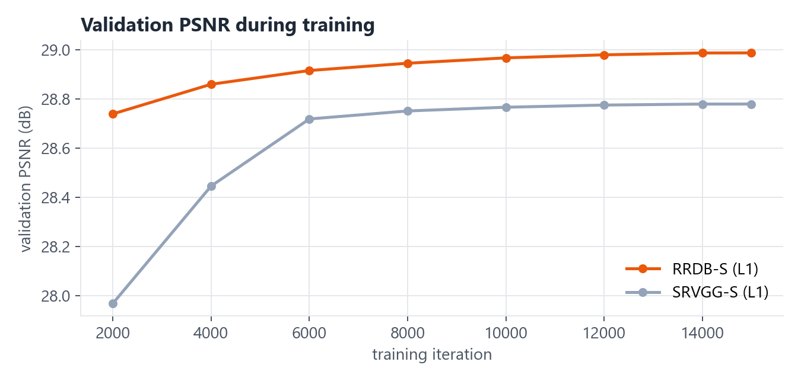

# PixelForge: evaluation results

Held-out **test** set: 60 Poly Haven CC0 textures never used for training or checkpoint selection (split by texture). Centre 512×512 crop → degraded → 128×128 input → ×4. Metrics on RGB, 4-px border cropped. Generated by `eval/evaluate.py` + `eval/make_figures.py`.

## Realistic degradation (blur + downscale + noise + JPEG)

| Method | Params | PSNR ↑ | SSIM ↑ | LPIPS ↓ | GPU ms / 128² tile | CPU ms (4 thr) |
|---|---|---|---|---|---|---|
| Nearest neighbour | – | 28.87 | 0.5911 | 0.5930 | – | – |
| Bicubic | – | 29.31 | 0.6119 | 0.7066 | – | – |
| Lanczos | – | 29.24 | 0.6079 | 0.7113 | – | – |
| Real-ESRGAN x4plus (pretrained) | 16.70M | 27.76 | 0.5451 | 0.4538 | 185.4 | 4313 |
| Real-ESRGAN general-v3 (pretrained) | 1.21M | 28.93 | 0.5973 | 0.5473 | 26.9 | 257 |
| **PixelForge RRDB-S, L1 (mine)** | 1.12M | 29.73 | 0.6201 | 0.6594 | 39.0 | 465 |
| **PixelForge SRVGG-S, L1 (mine)** | 0.16M | 29.66 | 0.6171 | 0.6358 | 15.2 | 36 |
| **PixelForge RRDB-S, GAN (mine)** | 1.12M | 28.76 | 0.5714 | 0.4143 | 36.0 | 479 |

## Clean bicubic downscale (classic SR setting)

| Method | Params | PSNR ↑ | SSIM ↑ | LPIPS ↓ | GPU ms / 128² tile | CPU ms (4 thr) |
|---|---|---|---|---|---|---|
| Nearest neighbour | – | 28.99 | 0.6311 | 0.4325 | – | – |
| Bicubic | – | 29.81 | 0.6595 | 0.5865 | – | – |
| Lanczos | – | 29.56 | 0.6484 | 0.6051 | – | – |
| Real-ESRGAN x4plus (pretrained) | 16.70M | 28.07 | 0.5758 | 0.3998 | 185.3 | – |
| Real-ESRGAN general-v3 (pretrained) | 1.21M | 28.93 | 0.6182 | 0.4799 | 24.9 | – |
| **PixelForge RRDB-S, L1 (mine)** | 1.12M | 30.32 | 0.6598 | 0.5478 | 42.3 | – |
| **PixelForge SRVGG-S, L1 (mine)** | 0.16M | 30.34 | 0.6624 | 0.4848 | 14.8 | – |
| **PixelForge RRDB-S, GAN (mine)** | 1.12M | 28.97 | 0.5878 | 0.3288 | 39.9 | – |

GPU: NVIDIA GeForce RTX 3050 Laptop GPU (fp16). Timings are for one 128×128 → 512×512 texture.

